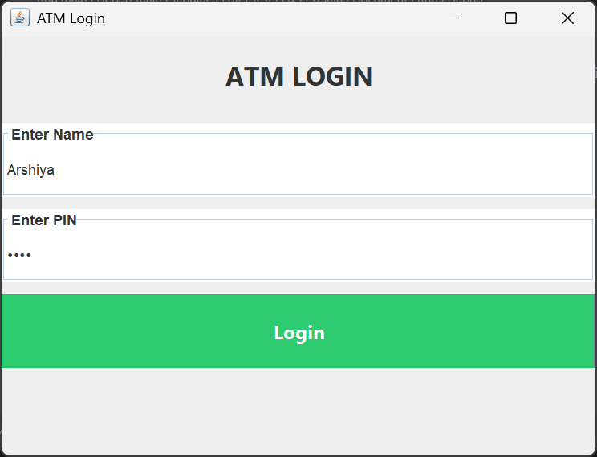
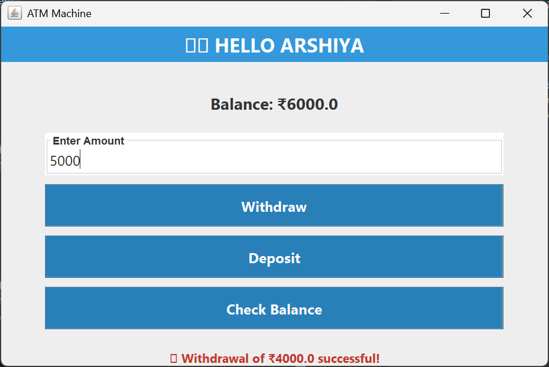

# 💳 ATM System (Java Swing Project)

## 📌 Project Overview

The **ATM System** is a Java-based desktop application that simulates the basic functions of an ATM machine.  

It provides a **graphical user interface (GUI)** built with **Java Swing**, where users can securely log in using their **Name + PIN**, and perform operations like:

* Withdraw money  
* Deposit money  
* Check balance  
* Exit the system  

The system validates user credentials and displays a **personalized greeting** (e.g., *“HELLO ARSHIYA”*) after login.

---

## ⚙️ Features

✔ **Secure Login** with Name & PIN  
✔ **Personalized Greeting** with user’s name  
✔ **Deposit & Withdraw** with balance validation  
✔ **Check balance** with real-time update  
✔ **GUI built using Java Swing**  
✔ **Object-Oriented Design** with multiple classes  

---

## 🗂️ Project Structure

ATMSystem/
│── BankAccount.java # Bank account details (name, PIN, balance)
│── ATMInterface.java # Main ATM GUI (after login)
│── LoginScreen.java # Login screen for credentials
│── ATMSystem.java # Main entry point


---

## 🖥️ Tech Stack

* **Language:** Java (JDK 23 or above)  
* **GUI Framework:** Java Swing  
* **Paradigm:** Object-Oriented Programming  

---

## 🚀 How to Run

### 1. Clone the Repository

    ```bash
        git clone https://github.com/your-username/ATMSystem.git
        cd ATMSystem
        
### 2. Compile the Project

    ```bash
        javac BankAccount.java ATMInterface.java LoginScreen.java ATMSystem.java

### 3. Run the Project

    ```bash
        java ATMSystem


## 🔑 Default Credentials

For demo purposes, you can log in with:
* Name: Arshiya
* PIN: 1234
(You can change this inside ATMSystem.java)

## 📸 Screenshots 

👉 Screenshots of:

Login screen


ATM interface



## Author

Arshiya Saiyyad


